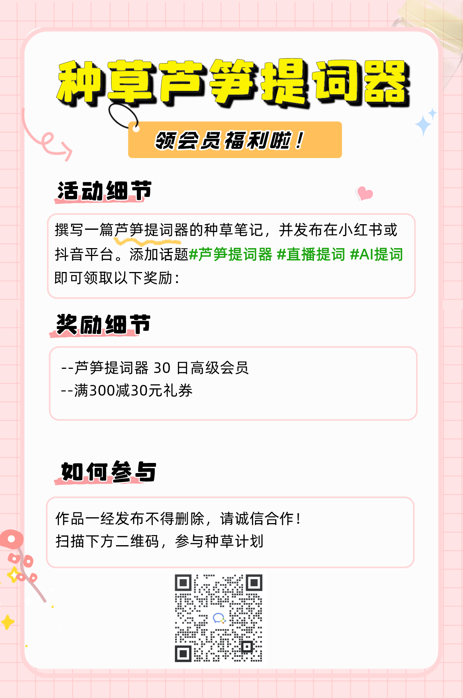
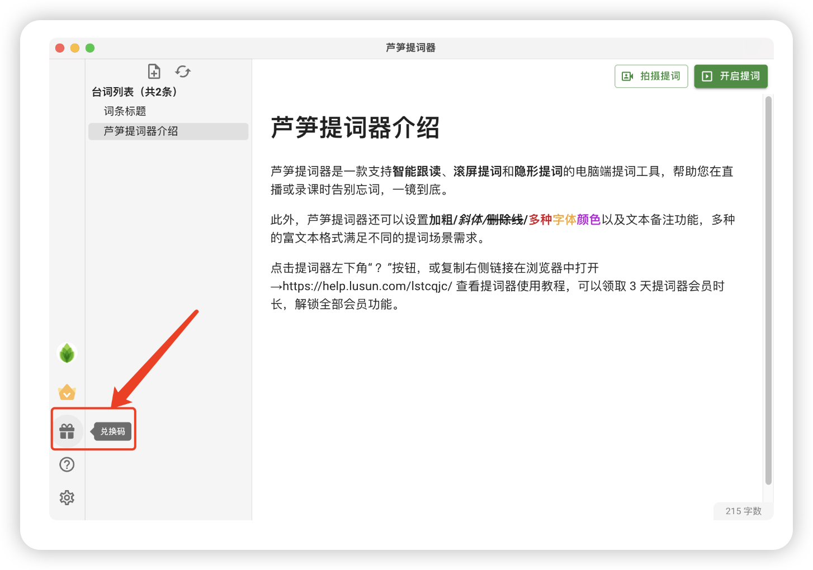
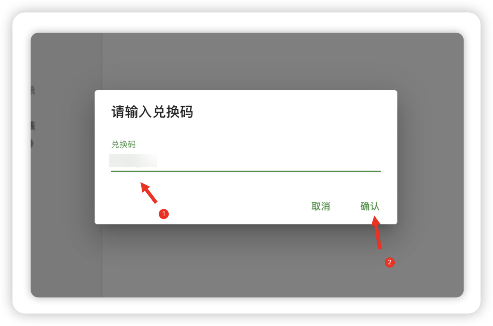

# 🥳 免费领会员

感谢你选择使用芦笋提词器，我们为大家开通了免费领取会员的通道。如果你刚了解芦笋提词器，推荐阅读 [芦笋提词器欢迎你](../) 了解更多～

## 邀请好友得会员 {#invite}

参与芦笋提词器的邀请活动，你将获得对应的会员奖励。你可以访问 [https://tcq.lusun.com/invite](https://tcq.lusun.com/invite) 将生成自己的邀请链接/海报，Ta 人通过你的专属链接注册成功后，你将获得对应的会员奖励，同时 Ta 也将获赠 15 天会员

## 参与芦笋提词器种草计划 {#plan}

如何参与芦笋提词器的种草笔记？你可以撰写一篇芦笋提词器的种草笔记（图文/视频均可），并发布在**小红书**或**抖音**平台，添加话题  **#芦笋提词器** **#直播提词 #AI 提词​**

即可获得领取 2 个福利

* 你将获得芦笋提词器 30 日高级会员兑换码
* 你将获得满 300 减 30 权益
> 不知道文案和配图怎么准备？点击[这里](materials.md)获取素材

<ImgCenter></ImgCenter>
<ImgDesc>芦笋提词器种草计划</ImgDesc>

### 如何使用兑换码？{#exchange}

第一步：打开「芦笋提词器」客户端，点击左下角“兑换码”按钮

<ImgCenter></ImgCenter>
<ImgDesc>电脑端兑换码入口</ImgDesc>

第二步：在弹出的输入框中，输入兑换口令，点击确认，即可领取

<ImgCenter></ImgCenter>
<ImgDesc>输入兑换码</ImgDesc>