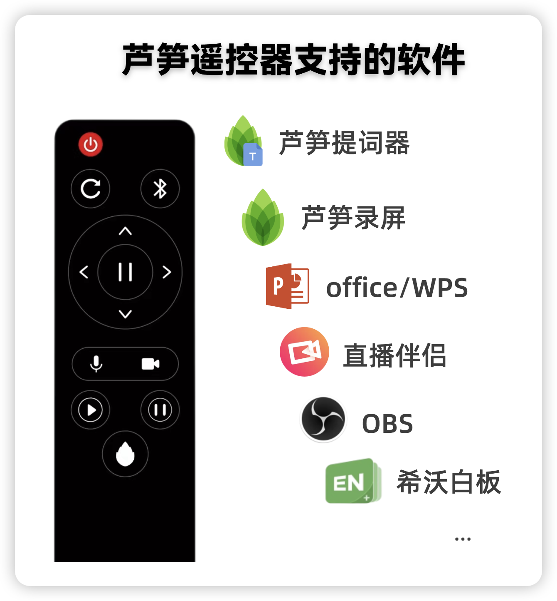
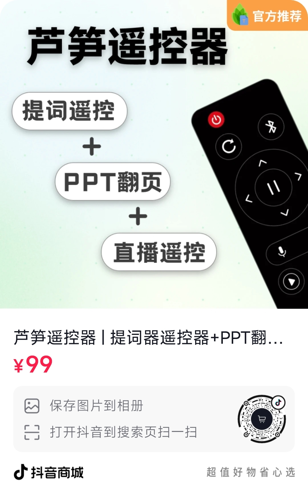
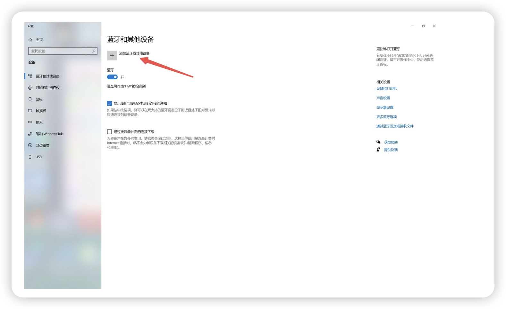
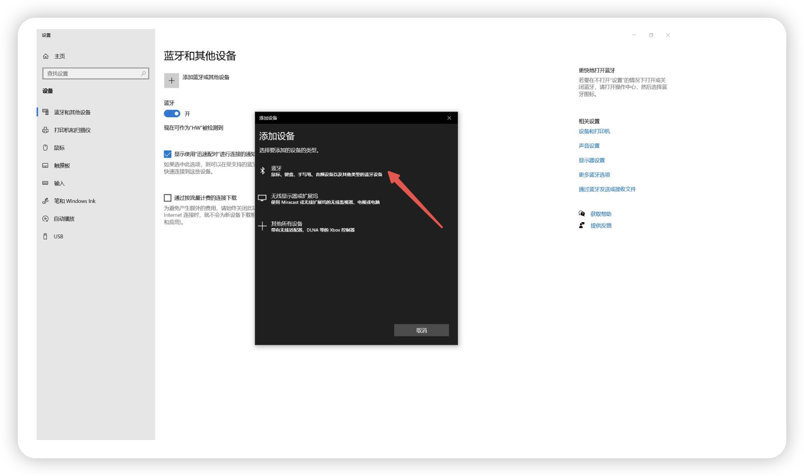
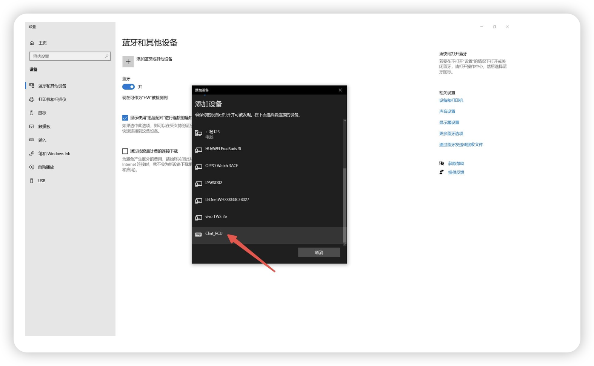
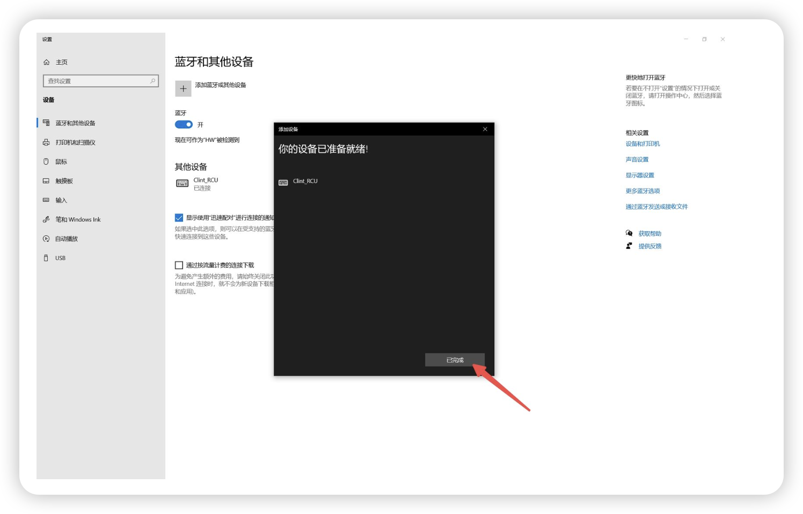
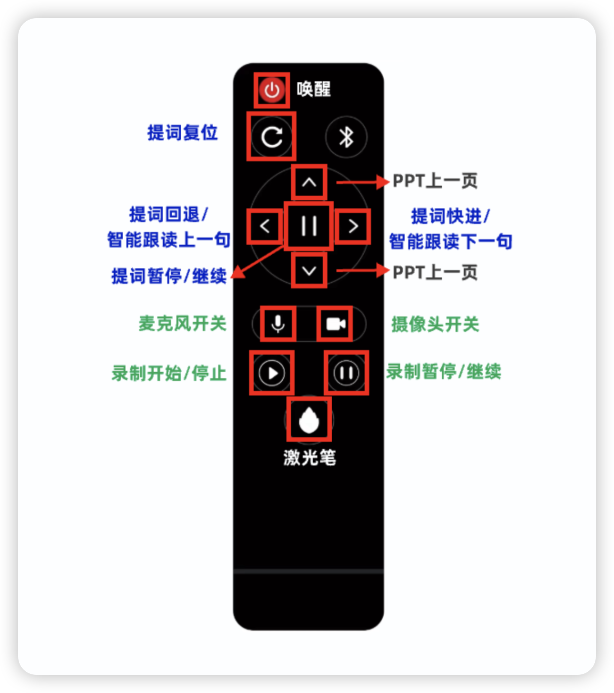
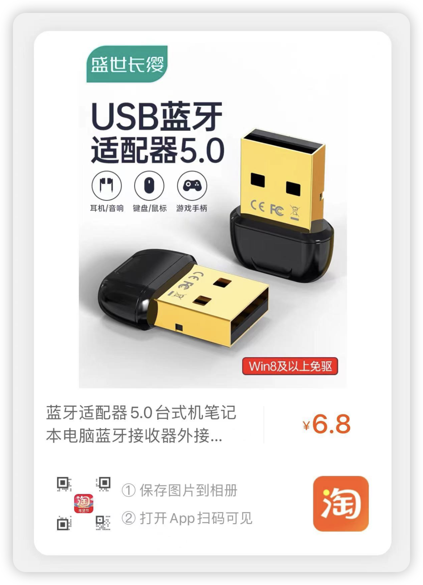
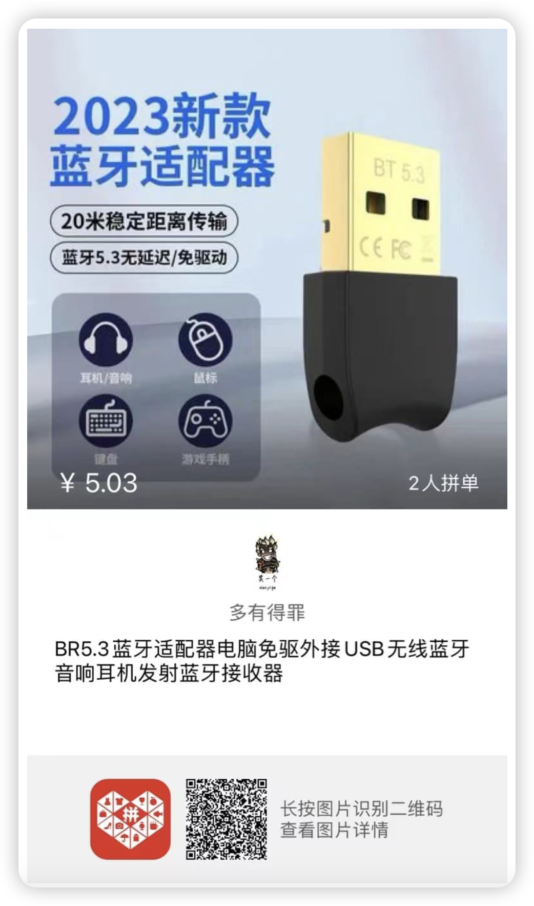

> **购买「芦笋提词器终身版」后，点击下方链接领取 👇🏻**

https://sourl.cn/fvTwCz

购买提词器终身版赠送的遥控器，可以填写这个表单领取哈，我们将在收到信息的 3 个工作日之内安排寄出

# ⌨️ 提词遥控器

> 关于如何使用芦笋遥控器，看这篇就够了

**芦笋遥控器**是一款支持「**提词器遥控**」 + 「**PPT 翻页**」 + 「**直录播遥控**」的三合一蓝牙遥控器；让直播、录课更轻松，此外，支持控制 **OBS** 和 **直播伴侣**等直录播软件。

## 一、遥控器介绍 {#introduce}

### 功能演示视频 {#demo}

<ImgCenter><video controls width="50%"><source src="../public/.gitbook/assets/ykqdemo.mp4" type="video/mp4" /></video></ImgCenter>

芦笋遥控器是一款支持遥控提词、PPT 翻页、以及遥控直播录播的三合一蓝牙遥控器。

本遥控器为黑色 ABS 外壳，蓝牙链接，配 2 节 7 号电池，激光功率 5mw，随机配备电池为体验电池，请尽快更换。

任何支持蓝牙功能的电脑都可连接使用，在录制视频或直播时，即使远离电脑，也能轻松控制提词进度、录制效果以及 ppt 页面，让内容创作更轻松。

同时，芦笋遥控器也可适配第三方直播录屏软件，如 OBS 和抖音直播伴侣等。

<ImgCenter></ImgCenter>

### 操作教程 {#tutorial}

<ImgCenter><video controls><source src="../public/.gitbook/assets/ykqshiyong.mp4" type="video/mp4" /></video></ImgCenter>

### 结合 OBS 使用 {#obs}

<ImgCenter><video controls><source src="../public/.gitbook/assets/obs.mp4" type="video/mp4" /></video></ImgCenter>

### 结合直播伴侣使用 {#bl}

<ImgCenter><video controls><source src="../public/.gitbook/assets/zhibobanlv.mp4" type="video/mp4" /></video></ImgCenter>

## 二、如何获取遥控器 {#how}

> 现在如果你购买芦笋提词器终身版，即可赠送一个价值 ¥99 的芦笋遥控器

终身版提词器：[购买链接直达](https://tcq.lusun.com/pricing/)

芦笋遥控器单品购买如下：

<ImgCenter></ImgCenter>

## 三、如何连接电脑 {#connect}

1.遥控器组装电池，确保遥控器处于有电状态

2.打开电脑蓝牙

win10 如何开启蓝牙 👉🏻[点击查看](https://jingyan.baidu.com/article/c33e3f48bdd46bab14cbb568.html?ref=help.lusun.com)

win11 如何开启蓝牙 👉🏻[点击查看](https://jingyan.baidu.com/article/2d5afd6903da6bc4a3e28e24.html?ref=help.lusun.com)

3.点击“添加蓝牙或其他设备”

<ImgCenter></ImgCenter>

4.点击“鼠标、键盘、手写板”一栏

<ImgCenter></ImgCenter>

5.寻找 **lusun**，点击进行配对连接

<ImgCenter></ImgCenter>

6.显示已完成，代表连接成功，就可以正常使用

<ImgCenter></ImgCenter>

## 四、遥控器按键说明 {#explain}

<ImgCenter></ImgCenter>

## 五、常见问题 {#faq}

#### Q1：电脑端搜索不到 lusun 设备？{#q1}

1. 可能和其他设备处于连接状态。关闭其他曾经连接过遥控器设备的蓝牙开关
2. 连接此设备之后，又连接其他设备，需要在电脑蓝牙界面删除所有之前连接过的 lusun 设备，然后重新链接。
3. 遥控器可能没电或处于休眠状态，按激光按钮确认遥控器是否有电，如果激光头工作则有电，按下红色电源按钮，唤醒遥控器进入工作状态

#### Q2：可以找到 lusun 但是无法连接 {#q2}

1. 关闭电脑蓝牙功能，重新打开，再尝试连接
2. 可多尝试连接几次，若依然无法连接，可重启电脑后再进行连接

#### Q3：电脑蓝牙显示无法连接 {#q3}

> 注意：先检查电脑是否有蓝牙功能
* 若电脑有蓝牙功能，建议升级蓝牙驱动，再尝试连接
  * Win10 更新蓝牙驱动教程 👉🏻 [jingyan.baidu.com](https://jingyan.baidu.com/article/6fb756ec84280b651958fb38.html?ref=help.lusun.com)
  * Win11 更新蓝牙驱动教程 👉🏻 [jingyan.baidu.com](https://jingyan.baidu.com/article/19192ad8082213a43f570709.html?ref=help.lusun.com)
* 若无蓝牙功能建议购买「蓝牙适配器」购买推荐
* 对于采购的蓝牙接收器要求：支持键盘功能，硬件版本 5.1 以上，若无蓝牙功能建议购买「蓝牙适配器」购买推荐

1. 拼多多购买👉🏻 [拼多多商城](https://mobile.yangkeduo.com/goods1.html?refer\_share\_id=Wu51UnPZYQKVZ5mrwPYqbVonUWv2fxuJ\&refer\_share\_channel=copy\_link&\_oak\_share\_detail\_id=3967211238\&pxq\_secret\_key=643ZNGHJQ6FP4YXPWOPYAAKUHPBNIJO6SH6RDU2MIEQCPYQ6L4ZQ&\_wvx=10&\_oak\_share\_time=1706074897&\_wv=41729\&share\_uin=LWSW46VBVG74PQ3RIOAWHKD5XU\_GEXDA&\_x\_query=%E8%93%9D%E7%89%99%E9%80%82%E9%85%8D%E5%99%A8\&page\_from=23\&refer\_share\_uin=LWSW46VBVG74PQ3RIOAWHKD5XU\_GEXDA\&goods\_id=513430445715&\_oak\_share\_snapshot\_num=503&\_x\_org=2\&ref=help.lusun.com)

2. 淘宝购买👉🏻 [淘宝商城](https://m.tb.cn/h.5JlCckAdbgbQTBe?tk=Tx0BWR6x1BX)

#### Q4：多台设备轮换使用同一个遥控器 {#more}

举例如下：首先遥控器和 A 设备连接，使用正常，关掉 A 设备蓝牙，连接 B 设备，使用正常，当在回来和 A 设备连接使用，需要重新配对使用，首先在已连接列表里面删除原有连接设备，重新进行蓝牙连接，如果广播列表找不到 Lusun 设备，可以把主机蓝牙关掉，然后在打开，重新寻找，并连接。以此类推。[\
](https://help.lusun.com/gao-xiao-ti-ci-lu-sun-ti-ci-qi-jie-jue-fang-an/)

**用户交流群**

<UserGroup/>