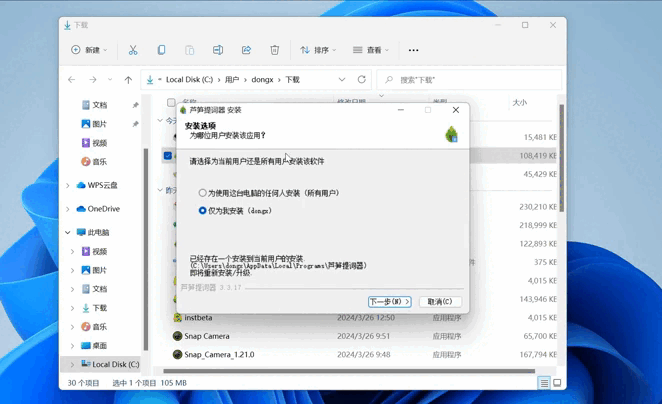

# 📥 下载与安装

欢迎使用芦笋提词器，当前电脑端和手机端均已支持。你可以按需下载 Windows、Mac、Android、iOS 多个版本。

## 第一步：下载芦笋提词器安装包 {#download}

点击以下链接，你将会打开芦笋提词器官网下载页，可根据您的设备按需下载。

<Link title="芦笋提词器官网下载页" logo="https://lusun.com/logo.png" url="https://tcq.lusun.com/download/?ref=docs_tcq"></Link>

<ImgCenter></ImgCenter>

**注意事项**

- Windows 系统下载注意事项：芦笋提词器当前仅支持 Win10 及以上系统
- macOS 系统下载注意事项：请确认你的设备是 M 系列芯片还是 Intel 芯片。如何查看请参考下图

<ImgCenter></ImgCenter>

## 第二步：安装芦笋提词器 {#install}

Windows 系统安装：你可以在下载列表中打开文件所在位置，即可找到安装包，双击打开安装包，一直点击下一步直至安装成功即可（推荐安装在默认路径）

<ImgCenter></ImgCenter>

macOs 系统安装：双击打开安装包，拖拽到 Application 文件夹即可安装成功

<ImgCenter></ImgCenter>

## 第三步：登录芦笋提词器 {#login}

> 目前芦笋提词器支持两种登陆方式：微信登录和手机号登录

方式 1：微信扫码登录，点击“手机号登录/注册”可切换登录方式

<ImgCenter></ImgCenter>

方式 2：手机验证码登录，输入你的手机号，点击发送验证码，将收到的验证码输入，即可登录成功；同理，点击“微信登录”可切换登录方式

<ImgCenter></ImgCenter>

**用户交流群**

<UserGroup/>
