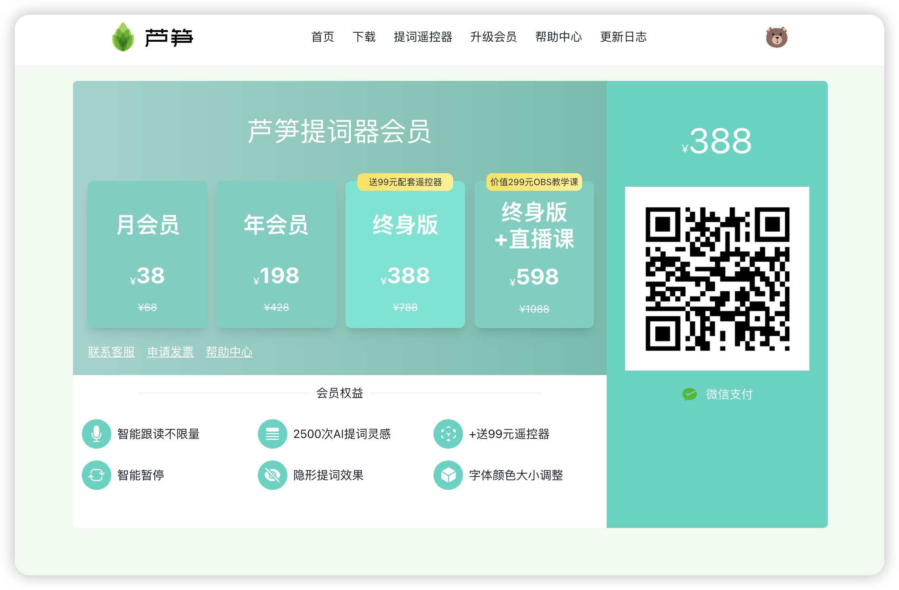
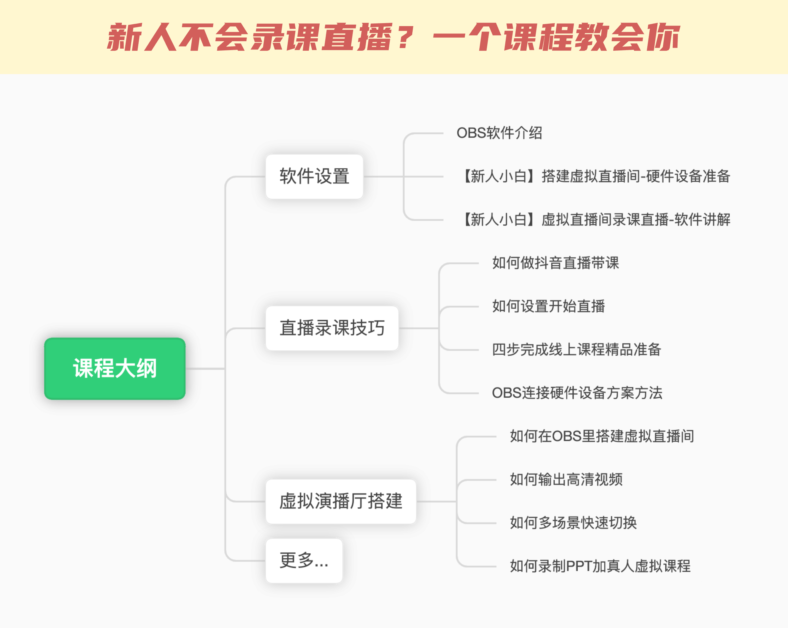

# 🌟 会员特权

> [!INFO]
> [芦笋提词器](https://tcq.lusun.com/)是一款支持智能跟读、隐形提词的应用，从此告别忘词，一镜到底。利用先进的语音识别功能，芦笋提词器的文本可以根据用户语速快慢，变换提词器滚动速度，完美贴合用户进度。不论直播 or 录屏，芦笋提词器应用都会自动穿透窗口，直播或录屏画面不会显示这款提词器，只有你自己能看到。轻松实现隐形提词

如果你想了解更多芦笋提词器，请访问：[欢迎来到芦笋提词器](../)

## 会员功能有哪些

<table><thead><tr><th width="163"></th><th width="143">免费版</th><th width="130">月会员</th><th width="137">年会员</th><th>终身版</th></tr></thead><tbody><tr><td>词条个数</td><td>3个</td><td>不限</td><td>不限</td><td>不限</td></tr><tr><td>匀速提词</td><td>✅</td><td>✅</td><td>✅</td><td>✅</td></tr><tr><td>智能跟读</td><td>❌</td><td>✅</td><td>✅</td><td>✅</td></tr><tr><td>富文本编辑</td><td>❌</td><td>✅</td><td>✅</td><td>✅</td></tr><tr><td>AI提词灵感</td><td>❌</td><td>100次</td><td>1500次</td><td>2500次</td></tr><tr><td>透明度调节</td><td>❌</td><td>✅</td><td>✅</td><td>✅</td></tr><tr><td>多词条展示</td><td>❌</td><td>✅</td><td>✅</td><td>✅</td></tr><tr><td>提词备注</td><td>❌</td><td>✅</td><td>✅</td><td>✅</td></tr><tr><td>多设备同步</td><td>❌</td><td>✅</td><td>✅</td><td>✅</td></tr><tr><td>遥控器赠送</td><td>❌</td><td>❌</td><td>❌</td><td>✅</td></tr></tbody></table>

## 如何购买

你可以通过芦笋提词器的客户端直接升级，也可以通过访问 [https://tcq.lusun.com/pricing/](https://tcq.lusun.com/pricing/) 付费升级

#### 【终身版 + 直播课】介绍

现在购买【终身版+直播课】套餐：可以获得价值 ¥299 的 OBS 宝藏教学礼包

**课程内容大纲**：

如何学习课程：购买【终身版 + 直播课】后，你将获得小鹅通的观看链接

  

